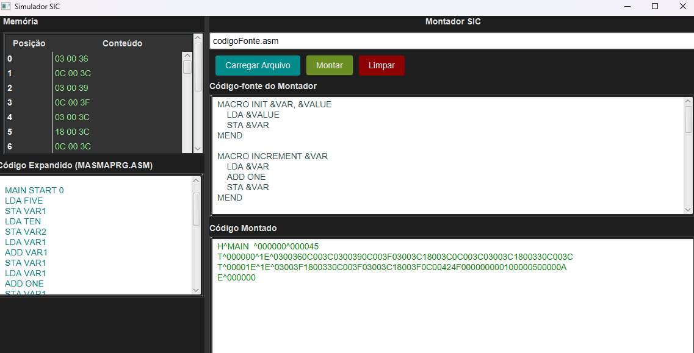

# sic-xe-simulator
Computador hipotético baseado na  arquitetura do livro :Sytems Software: An Introduction to System  Programming; Leland L. Beck

## Funcionalidades
- Simula a arquitetura SIC/XE.
- Suporta instruções em linguagem assembly.
- Oferece ferramentas de depuração para execução passo a passo.

## Contribuindo
Contribuições são bem-vindas! Leia o arquivo `CONTRIBUTING.md` para as diretrizes.

## Licença
Este projeto está licenciado sob a Licença MIT. Consulte o arquivo `LICENSE` para mais detalhes.
